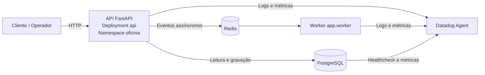

# Oficina Mecânica | Aplicação principal

API REST da solução Oficina Mecânica, construída com FastAPI e executada em Kubernetes.

## Visão geral

| Item | Informação |
| --- | --- |
| Responsabilidade | API, regras de negócio, worker e integrações |
| Runtime | Python 3.12 |
| Entrada principal | Kubernetes Service `api` na porta `8000` |
| Ambientes | `homologacao` e `production` |
| Pipeline | [GitHub Actions](.github/workflows/ci-cd.yml) |
| Estado operacional | Operacional quando o cluster, banco e Redis estão disponíveis |

## Arquitetura geral



## Stack e componentes

- Python 3.12, FastAPI e SQLAlchemy
- PostgreSQL e Redis
- Docker e Kubernetes
- Alembic para migrações
- GitHub Actions para testes, imagem e deploy
- Datadog para logs, métricas e alertas

## Status operacional e endpoints (Swagger / OpenAPI)

| Verificação / Documentação | Caminho / URL | Descrição |
| --- | --- | --- |
| **Swagger UI (Interativo)** | [`/docs`](http://localhost:8000/docs) | Interface interativa OpenAPI para teste dos endpoints |
| **ReDoc** | [`/redoc`](http://localhost:8000/redoc) | Documentação técnica alternativa em formato ReDoc |
| **OpenAPI Schema (JSON)** | [`/openapi.json`](http://localhost:8000/openapi.json) | Especificação OpenAPI 3.0 para importação no Postman/Insomnia |
| **Healthcheck** | [`/health`](http://localhost:8000/health) | Verificação de disponibilidade e uptime da aplicação |
| **Métricas** | [`/metrics`](http://localhost:8000/metrics) | Snapshot de requisições, latências P95 e status |
| **Imagem de Container** | `ghcr.io/jptureta/postechfiap_mecanica:latest` | Imagem Docker oficial publicada via CI/CD |

*Nota: Em ambiente local ou via port-forward, acesse em `http://localhost:8000/docs` (ou porta `30000` via NodePort). Em produção na AWS, acesse através da URL base do API Gateway / Load Balancer.*

## Deploy e acesso

### Deploy automatizado

O deploy é executado pelo [pipeline de CI/CD](.github/workflows/ci-cd.yml):

- branch `main`: branch principal protegida; recebe Pull Requests de features e passa pelos checks obrigatórios (não faz deploy sozinha);
- branch `homologacao`: deploy automático de homologação;
- branch `production`: deploy automático de produção;
- imagem publicada no GHCR antes da aplicação dos manifests.

### Acesso local ou via NodePort

O Service Kubernetes é `NodePort` na porta `30000`:

- API: http://localhost:30000
- Swagger: http://localhost:30000/docs
- Health: http://localhost:30000/health

Em cluster remoto, substitua `localhost` pelo IP do node ou endereço do LoadBalancer/Ingress.

### Acesso via port-forward

```bash
kubectl get pods -n oficina
kubectl get svc -n oficina
kubectl port-forward svc/api 8000:8000 -n oficina
```

Com o encaminhamento ativo:

- Swagger: http://localhost:8000/docs
- Health: http://localhost:8000/health

## Execução local

```bash
cp .env.example .env
uv sync --dev
uv run pytest
uv run uvicorn app.main:app --reload --port 8000
```

Alternativamente, use o ambiente definido em `docker-compose.yml`.

## CI/CD e configuração

O pipeline instala dependências, executa testes, constrói e publica a imagem Docker e aplica os manifests Kubernetes. Os secrets esperados incluem `KUBE_CONFIG`, `DB_PASSWORD` e `JWT_SECRET_KEY`; as demais configurações devem seguir `.env.example` e os manifests em `k8s/`.

## Observabilidade

- logs estruturados em JSON com `X-Request-ID`;
- métricas HTTP e de negócio em `app/observability.py`;
- endpoint `/metrics` para diagnóstico;
- probes de liveness, readiness e startup;
- manifesto do Datadog Agent em `k8s/datadog-agent.yaml`;
- dashboard de exemplo em `datadog-dashboard-example.yaml`;
- definição declarativa de alertas e monitores em `datadog-monitors.yaml`.

## Estrutura do repositório

```text
app/                 Código da API, domínio e worker
alembic/             Migrações do banco
k8s/                 Deployments, Services, probes e Datadog
tests/               Testes automatizados
Dockerfile           Imagem da aplicação
.github/workflows/   Pipeline de CI/CD
```

## Segurança e governança

- `main` protegida; deploys automáticos partem das branches `homologacao` e `production`, ambas também protegidas contra push direto;
- secrets não devem ser versionados;
- containers executam sem privilégios elevados;
- merge somente via Pull Request com checks obrigatórios.
