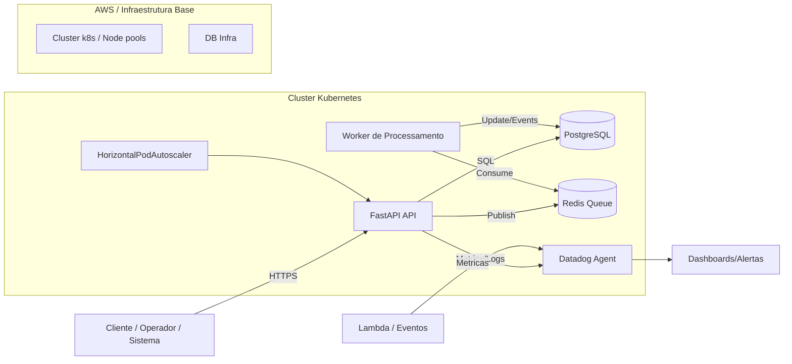
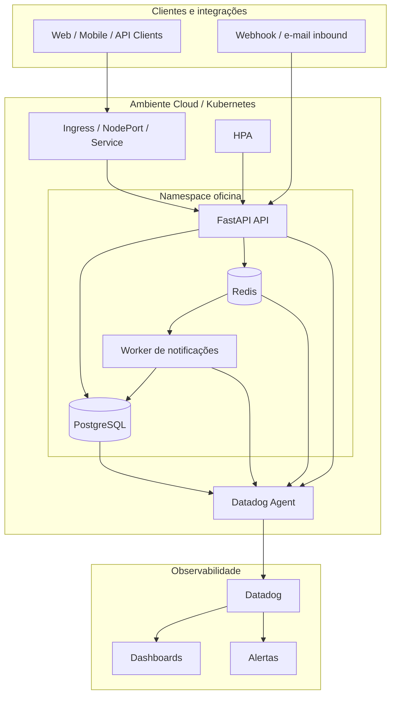
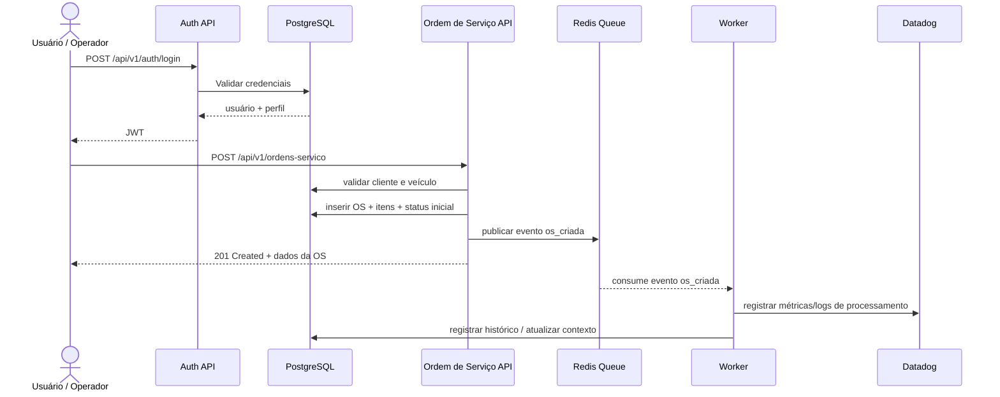
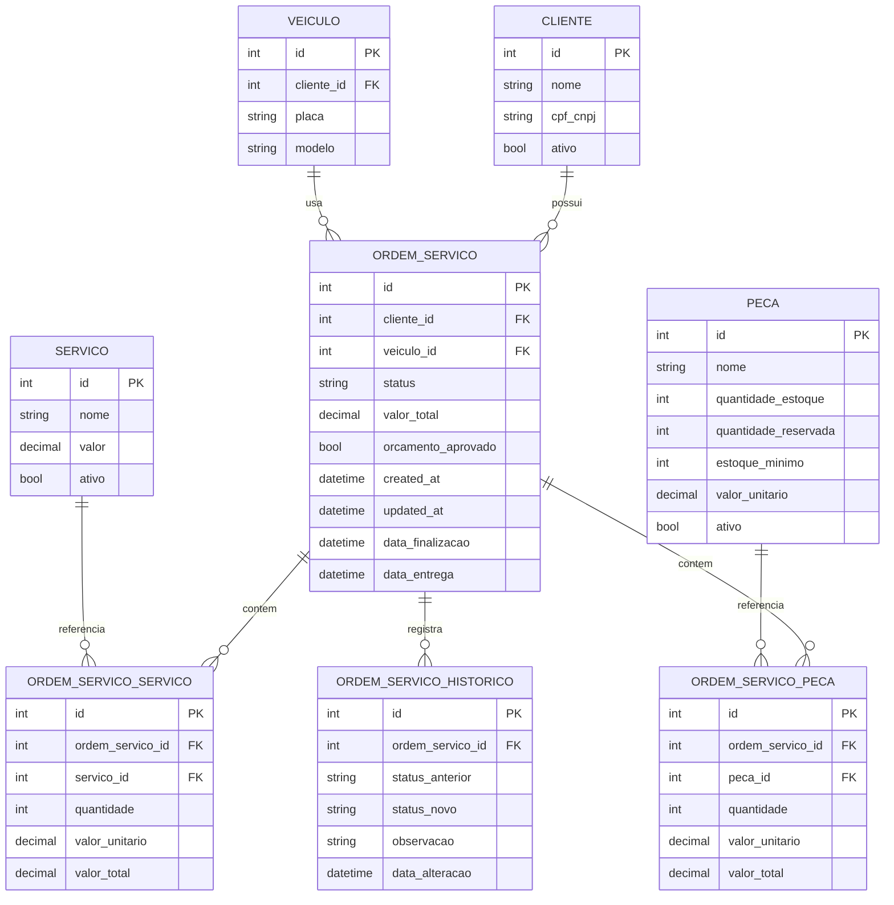
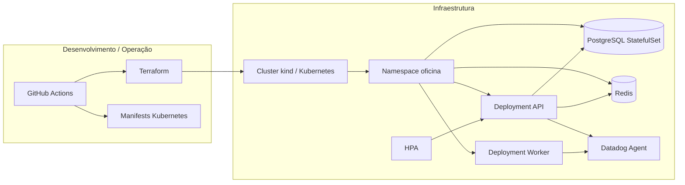
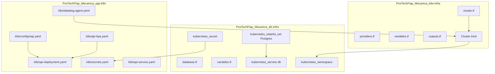
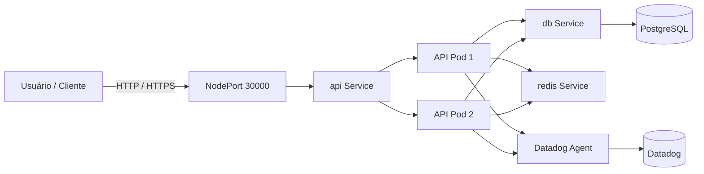

# Documentação da Arquitetura

## 1. Visão geral

A solução de Oficina Mecânica foi estruturada em quatro repositórios complementares:

- API principal em FastAPI e Kubernetes
- Infraestrutura do banco de dados em Terraform
- Infraestrutura do cluster Kubernetes em Terraform
- Lambda para eventos e processamento assíncrono

A arquitetura foi desenhada para suportar processamento transacional de ordens de serviço, observabilidade em tempo real e escalabilidade horizontal em Kubernetes.

## 2. Objetivos de arquitetura

- Garantir integridade das ordens de serviço e do ciclo de vida de status
- Permitir escalonamento horizontal com HPA em containers Kubernetes
- Separar responsabilidades por domínio e infraestrutura
- Expor saúde da API e métricas para observabilidade
- Registrar eventos e falhas com correlação de requisições
- Utilizar banco relacional para consistência de transações e histórico

## 3. Contexto de negócio e requisitos

A aplicação atende ao fluxo de oficina mecânica:

- cadastro de clientes e veículos
- abertura de ordens de serviço
- inclusão de serviços e peças
- aprovação do orçamento
- alteração de status (Diagnóstico, Execução, Finalização, Entrega)
- histórico de transições
- processamento de notificações e eventos

Requisitos não funcionais relevantes:

- disponibilidade e resiliência em Kubernetes
- latência aceitável da API
- integridade de dados e auditoria
- observabilidade com logs, métricas e alertas
- suporte a componentes cloud-native

## 4. Arquitetura lógica

A arquitetura combina APIs síncronas, fila de processamento, banco relacional e stack de monitoramento.

### Componentes principais

- API principal: FastAPI em Kubernetes para CRUD, autenticação, regras de negócio e endpoints de ordem de serviço
- Banco de dados: PostgreSQL para dados transacionais e histórico de ordens
- Redis: fila para eventos e processamento assíncrono de notificações
- Worker: consumidor da fila para publicação de eventos e processamento de alertas
- Lambda: processamento serverless de eventos externos e integrações assíncronas
- Datadog: coleta de logs, métricas e alertas, com integração ao Kubernetes

## 5. Diagrama de componentes

### Visão de responsabilidades

- API: regras de negócio, autenticação, transições de status e endpoints externos
- Banco: persistência relacional, integridade, histórico e auditoria
- Redis: fila de eventos e desacoplamento de processamento de notificações
- Datadog: métricas, logs e alertas
- Kubernetes: provisionamento, orquestração, escalabilidade e healthcheck

## 6. Diagrama de sequência: autenticação e abertura de ordem de serviço

### Observações do fluxo

- A autenticação utiliza JWT, com foco em sessões curtas e validação no endpoint
- A criação da ordem é transacional no banco para manter consistência
- O evento de ordem criada é assíncrono na fila para notificações e monitoramento sem bloquear o cliente
- O Datadog coleta contexto de cada etapa para metricar tempo e falhas

## 7. RFCs (Request for Comments)

### RFC 001 — Escolha da nuvem e orquestração

- Contexto: a aplicação exige API escalável, tolerante a falhas e deploy em ambiente controlado
- Decisão: usar Kubernetes em ambiente cloud/local com Terraform para provisionamento e `kind` para desenvolvimento local
- Justificativa: separação clara entre infraestrutura e aplicação, maior previsibilidade e suporte a HPA
- Consequências:
  - necessidade de manter manifests e configurações de ambiente versionados
  - mais complexidade operacional comparada a monolito single-instance
  - melhora de resiliência e escalabilidade

### RFC 002 — Escolha do banco de dados

- Contexto: o sistema precisa registrar clientes, veículos, ordens, itens, histórico e status
- Decisão: PostgreSQL como banco principal
- Justificativa: suporte transacional, consultas complexas, integridade referencial, enumeração de status e auditoria
- Consequências:
  - schema relacional bem definido
  - histórico de status persistido
  - melhor aderência para regras de aprovação e estoque

### RFC 003 — Estratégia de autenticação

- Contexto: endpoints sensíveis e gerenciamento de permissões para usuários da oficina
- Decisão: JWT assinado com secret em ambiente controlado
- Justificativa: modelo simples, stateless e compatível com API REST em containers
- Consequências:
  - autenticação eficiente para serviços stateless
  - necessidade de configurar `JWT_SECRET_KEY` por ambiente
  - exigência de expiração e renovação de token

## 8. ADRs (Architecture Decision Records)

### ADR 001 — Padrão de comunicação: HTTP síncrono + fila assíncrona

- Status: Aceito
- Contexto: há operações que precisam resposta imediata e outras que podem ser desacopladas
- Decisão: endpoints síncronos para criação e consulta; fila Redis para eventos de notificações e processamento
- Consequências:
  - API responsiva para usuários finais
  - processamento lateral desacoplado
  - necessidade de lidar com reprocessamento e monitoramento de fila

### ADR 002 — Uso de HPA e escalabilidade horizontal

- Status: Aceito
- Contexto: variação de carga em horários de pico ou múltiplas ordens simultâneas
- Decisão: aplicar `HorizontalPodAutoscaler` com métricas de CPU e memória
- Consequências:
  - maior capacidade em picos de demanda
  - melhor utilização de recursos
  - risco de latência em processos de inicialização caso a app tenha cold start

### ADR 003 — Observabilidade como parte do desenho da aplicação

- Status: Aceito
- Contexto: requisitos de monitoramento, uptime e rastreio de falhas em produção
- Decisão: logs JSON estruturados, métricas de API e Kubernetes, e Datadog como ferramenta central
- Consequências:
  - rastreio de correlação por request ID
  - alertas de falhas em operações críticas
  - operação mais diagnóstica e previsível

## 9. Justificativa formal para a escolha do banco de dados

A decisão por PostgreSQL foi motivada por quatro critérios fundamentais:

1. Integridade transacional
   - o ciclo de vida da ordem de serviço exige transações confiáveis ao alterar status, efetivar estoque e preservar histórico
2. Relacionamento entre entidades
   - o modelo de clientes, veículos, peças, serviços e ordens é naturalmente relacional
3. Auditoria do histórico
   - as transições de status precisam ser preservadas em tabela específica para rastreabilidade
4. Operação em Kubernetes
   - o banco é provisionado como StatefulSet com volume persistente, adequado para ambientes orquestrados

### Modelo relacional ajustado

O desenho relacional foi ajustado para refletir o domínio real de oficina mecânica:

- `clientes` e `veiculos` são entidades independentes relacionadas a múltiplas ordens
- `ordens_servico` centraliza a operação principal
- `ordens_servico_servicos` e `ordens_servico_pecas` modelam itens compostos da ordem
- `ordens_servico_historico` registra todas as mudanças de status
- `servicos` e `pecas` são catalogados e reutilizados por várias ordens

### Diagramas ER

### Relacionamentos e impacto

- Um cliente pode ter vários veículos e várias ordens
- Um veículo pode estar associado a várias ordens ao longo do tempo
- Uma ordem possui vários serviços e peças
- Cada alteração de status gera registro no histórico, permitindo auditoria e análise de tempo médio por etapa
- As peças possuem controle de estoque e reserva para impedir inconsistência de aprovação e finalização

## 10. Diagramas de deploy

A solução é implantada em camadas, com infraestrutura separada para cluster, banco e aplicação.

### Fluxo de implantação

1. O repositório de infraestrutura provisiona o cluster e o namespace.
2. O repositório de banco provisiona o PostgreSQL e seus recursos de rede e storage.
3. O repositório da aplicação publica a imagem e aplica os manifests do Kubernetes.
4. O Datadog Agent coleta métricas e logs dos pods do cluster.
5. O HPA ajusta o número de réplicas conforme demanda de CPU e memória.

## 11. Diagramas da infraestrutura Terraform

### Visão do provisionamento por repositório

### Infraestrutura de rede e acesso

### Infraestrutura como código observada

- O cluster é provisionado com Terraform e `kind` em um ambiente local ou cloud
- O namespace da aplicação e os recursos básicos ficam no repositório de infraestrutura Kubernetes
- O banco de dados é provisionado como StatefulSet com armazenamento persistente em um repositório dedicado
- A aplicação recebe os valores via ConfigMap e Secret, reduzindo acoplamento entre código e infraestrutura
- O HPA e a coleta de métricas são componentes centrais no deployment, reforçando a arquitetura de observabilidade

## 12. Conclusão

A arquitetura atual é coerente com os requisitos de negócio e de operação:

- processamento transacional em banco relacional
- desacoplamento de notificações por fila
- escalabilidade via Kubernetes e HPA
- monitoramento centralizado em Datadog
- infraestrutura provisionada por Terraform de forma modular
- documentação técnica que sustenta manutenção e evolução

Essa estrutura reduz risco de inconsistência, melhora observabilidade e permite evolução incremental sem quebrar o domínio do sistema.
