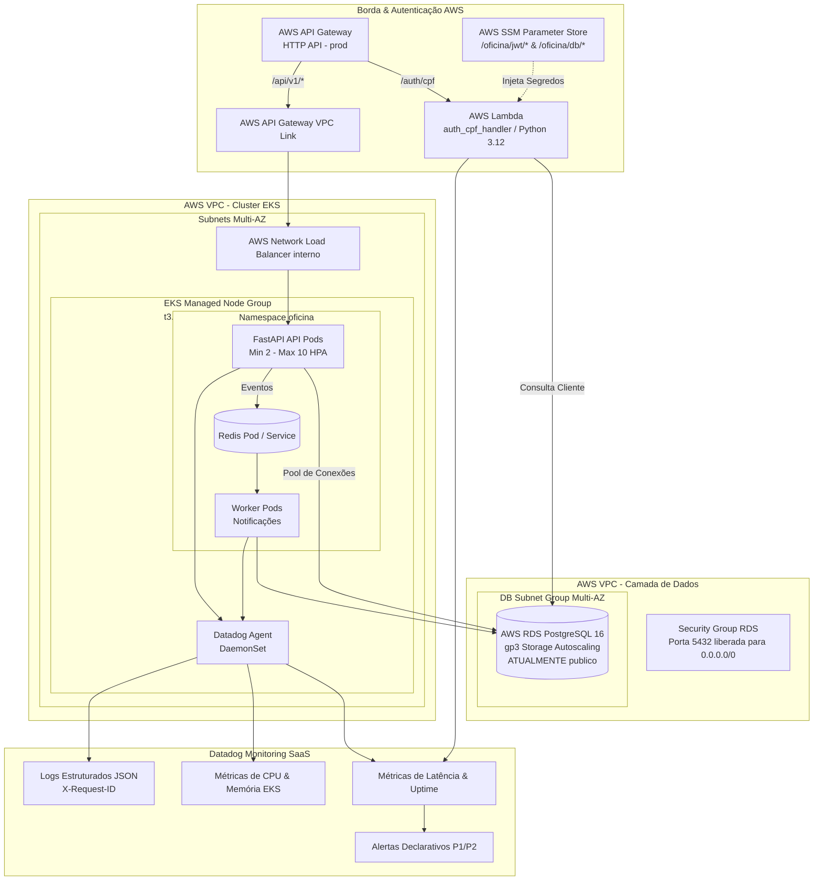
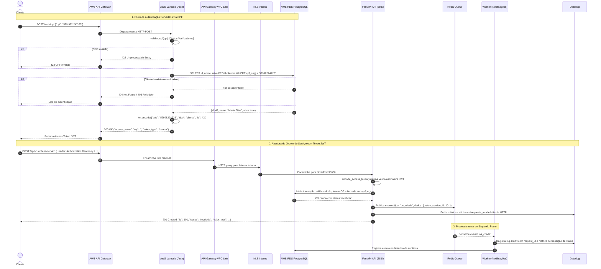
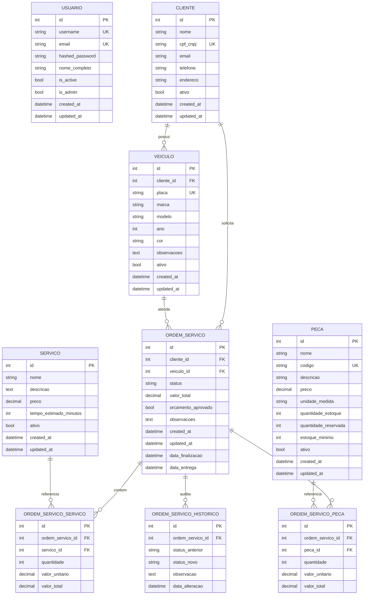
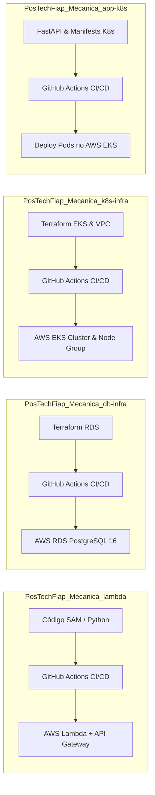

# Documentação da Arquitetura — Oficina Mecânica (Fase 3)

## 1. Visão Geral

A solução de Oficina Mecânica foi estruturada em quatro repositórios complementares integrados aos serviços gerenciados da AWS:

- **`PosTechFiap_Mecanica_app-k8s`**: Aplicação principal em FastAPI executando em cluster Kubernetes (AWS EKS), com workers assíncronos e HPA.
- **`PosTechFiap_Mecanica_db-infra`**: Infraestrutura Terraform responsável pelo banco de dados gerenciado **AWS RDS PostgreSQL 16**.
- **`PosTechFiap_Mecanica_k8s-infra`**: Infraestrutura Terraform responsável pela VPC dedicada e pelo cluster **AWS EKS com Managed Node Group escalável**.
- **`PosTechFiap_Mecanica_lambda`**: Function Serverless (AWS Lambda) integrada ao **AWS API Gateway** para validação de CPF e autenticação por JWT.

A arquitetura foi desenhada para garantir alta disponibilidade, integridade transacional das ordens de serviço, segurança na borda com autenticação por CPF, e observabilidade em tempo real com Datadog.

---

## 2. Objetivos de Arquitetura

- **Isolamento e Borda Segura:** Autenticação delegada para AWS API Gateway e Lambda Serverless, protegendo as APIs principais via validação de CPF.
- **Escalabilidade em Duas Camadas:** Horizontal Pod Autoscaler (HPA) no Kubernetes para a aplicação (2 a 10 pods) e Auto Scaling no Managed Node Group do EKS (2 a 5 nós EC2).
- **Banco de Dados Gerenciado:** Transações seguras com ACID, storage autoscaling, backups automatizados e isolamento multi-AZ no AWS RDS PostgreSQL.
- **Desacoplamento Orientado a Eventos:** Fila Redis para processamento assíncrono de notificações e histórico de ordens de serviço sem onerar o tempo de resposta da API.
- **Observabilidade Unificada:** Coleta de métricas de negócio, latência, recursos de Kubernetes e logs estruturados em JSON correlacionados por `X-Request-ID` via Datadog.

---

## 3. Contexto de Negócio e Requisitos

A aplicação gerencia o ciclo completo de ordens de serviço (OS) de uma oficina mecânica:
- Cadastro e acompanhamento de clientes e veículos.
- Abertura de ordens de serviço com orçamento de peças e serviços.
- Aprovação/recusa de orçamentos (inclusive via webhooks externos).
- Ciclo de vida e máquina de estados das ordens (`Recebida` → `Em Diagnóstico` → `Aguardando Aprovação` → `Em Execução` → `Finalizada` → `Entregue` / `Cancelada`).
- Gestão de estoque com reserva automática de peças na aprovação e baixa na finalização.
- Relatórios de tempo médio por etapa e volumes operacionais.

---

## 4. Arquitetura Lógica

```mermaid
flowchart TD
    Cliente[Cliente / Sistema Externo] -->|1. POST /auth/cpf| APIGW[AWS API Gateway HTTP]
    APIGW -->|Trigger| Lambda[AWS Lambda Auth]
    Lambda -->|Valida CPF & Consulta Cliente| RDS[(AWS RDS PostgreSQL 16)]
    Lambda -->>|Retorna JWT com sub: CPF| Cliente

    Cliente -->|2. Chamadas com Bearer JWT| APIGW
    APIGW -->|VPC Link| NLB[NLB interno]
    NLB -->|NodePort 30000| EKS_API[FastAPI API no AWS EKS]

    subgraph EKS[Cluster AWS EKS]
        EKS_API -->|Transacoes SQL| RDS
        EKS_API -->|Publica Eventos| Redis[(Redis Queue)]
        Worker[Worker de Notificacoes] -->|Consome Eventos| Redis
        Worker -->|Atualiza Historico| RDS
        HPA[Horizontal Pod Autoscaler] -.->|Auto Scale 2-10| EKS_API
        DDAgent[Datadog Agent DaemonSet]
    end

    EKS_API -->|Métricas & Logs JSON| DDAgent
    Lambda -->|Métricas StatsD| DatadogCloud[(Datadog SaaS)]
    DDAgent --> DatadogCloud
    DatadogCloud --> Dashboards[Dashboards & Alertas P1/P2]
```

---

## 5. Diagrama de Componentes

Visão integrada de nuvem AWS, APIs, banco de dados e monitoramento:



---

## 6. Diagrama de Sequência: Autenticação por CPF e Abertura de OS

Fluxo de ponta a ponta demonstrando a interação entre cliente, API Gateway, Lambda, banco de dados e cluster EKS:



---

## 7. RFCs (Request for Comments)

Os registros de decisão técnica são mantidos individualmente em `docs/rfcs/`. A tabela abaixo funciona como índice e resumo do estado atual.

| ID | Registro | Status |
| --- | --- | --- |
| RFC 001 | [AWS e EKS](rfcs/RFC-001-aws-eks.md) | Aceito |
| RFC 002 | [RDS PostgreSQL 16](rfcs/RFC-002-rds-postgresql.md) | Aceito com ressalva de seguranca |
| RFC 003 | [Autenticacao por CPF e JWT](rfcs/RFC-003-autenticacao-cpf-jwt.md) | Aceito |
| RFC 004 | [Endurecimento do RDS](rfcs/RFC-004-endurecimento-rds.md) | Proposto |

---

## 8. ADRs (Architecture Decision Records)

Os registros de decisão arquitetural são mantidos individualmente em `docs/adrs/`. A tabela abaixo funciona como índice e resumo do estado atual.

| ID | Registro | Status |
| --- | --- | --- |
| ADR 001 | [HTTP síncrono e Redis](adrs/ADR-001-comunicacao-http-redis.md) | Aceito com ressalva de durabilidade |
| ADR 002 | [HPA e escalabilidade](adrs/ADR-002-hpa-escalabilidade.md) | Aceito |
| ADR 003 | [Observabilidade com Datadog](adrs/ADR-003-observabilidade-datadog.md) | Aceito |

---

## 9. Justificativa Formal para a Escolha do Banco de Dados

A escolha do **PostgreSQL 16 (AWS RDS)** como tecnologia de persistência é sustentada por:

1. **Garantias ACID e Consistência Transacional:** O ciclo de vida de uma ordem de serviço envolve múltiplas tabelas (OS, itens de peça, itens de serviço, histórico e estoque). O PostgreSQL garante que reservas de peças e baixas de estoque ocorram atomicamente com a mudança de status.
2. **Integridade Referencial Rigorosa:** Foreign keys garantem que peças e serviços não sejam excluídos enquanto houver ordens vinculadas, e que veículos e ordens pertençam a clientes válidos.
3. **Auditoria Contínua:** Tabela de histórico dedicada (`ordens_servico_historico`) que armazena cada mudança de estado com timestamp e observações, viabilizando o cálculo preciso de métricas operacionais.

### Estado da implantação e ajustes do modelo

As migrations são a fonte da verdade do modelo. O diagrama abaixo foi alinhado a elas: `servicos.preco`, `pecas.preco`, `pecas.codigo`, `pecas.unidade_medida`, `orcamento_aprovado` e a tabela `usuarios` refletem ajustes posteriores do modelo. Os itens de OS mantêm `valor_unitario` e `valor_total` próprios para preservar o preço praticado no momento da abertura, mesmo que o catálogo seja alterado posteriormente.

### Diagrama Entidade-Relacionamento (ER)



---

## 10. Estrutura Modular dos Repositórios e CI/CD

A infraestrutura e o ciclo de vida de deploy são segregados de acordo com os 4 repositórios:



Cada repositório possui esteira com execução de testes, validação de IaC (`validate`/`plan`) e deploy automático nos ambientes de **homologação** e **produção**.
